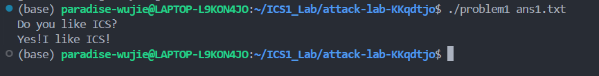
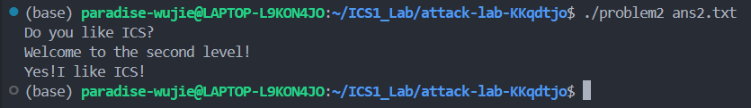
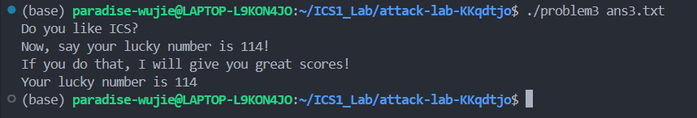
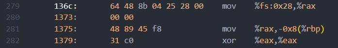
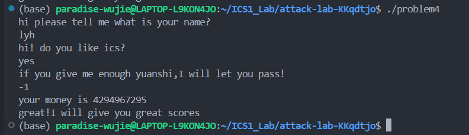

# 栈溢出攻击实验报告

**姓名**：刘远航

**学号**：2023202275

---

## 题目解决思路

### Problem 1: 基础栈溢出劫持执行流

- **分析**：
  在阅读 problem1的汇编代码时，我重点观察了 func函数。发现程序通过 `sub $0x20, %rsp` 分配空间，但实际的缓冲区起始地址是在 rbp-0x8（通过 `lea -0x8(%rbp), %rax` 指令确认）。紧接着程序调用了strcpy。由于 strcpy 不检查边界，我可以构造一个超长字符串来填满这 8 字节的缓冲区，再覆盖掉 8 字节的 old rbp，最后将原本指向 main 函数的返回地址修改为目标函数 func1 的起始地址 0x401216。

  *   **缓冲区偏移**：8 (Buffer) + 8 (Saved RBP) = 16 字节。
  *   **跳转目标**：func1 (0x401216)，对应小端序十六进制为 `\x16\x12\x40\x00\x00\x00\x00\x00`。

- **解决方案**：
  编写 Python 脚本生成包含 16 字节垃圾字符和 8 字节目标地址的 ans1.txt：

  ```python
  padding = b'A' * 16 
  target_addr = b'\x16\x12\x40\x00\x00\x00\x00\x00'
  with open("ans1.txt", "wb") as f:
      f.write(padding + target_addr)
  ```

- **结果**：
  运行 `./problem1 ans1.txt`，程序成功跳转并输出了预期的字符串`Yes!I like ICS!`
  

---

### Problem 2: 绕过 NX 保护的 ROP 攻击

- **分析**：
  这道题开启了 NX 保护，意味着我不能在栈上执行代码，且目标函数func2 增加了参数校验。在 func2 的汇编中，我看到 `cmpl $0x3f8, -0x4(%rbp)`，这说明我必须让第一个参数（%edi ）等于 0x3f8才能触发成功分支。

  我利用 objdump 寻找 Gadget，发现程序自带了一个 pop_rdi 函数（地址 0x4012bb），其中的 `pop %rdi; ret` 指令序列（地址 0x4012c7）非常完美。

  我设计了以下攻击链：

  1.  填满缓冲区（偏移量经分析为 16 字节）。
  2.  返回地址覆盖为 0x4012c7 (`pop %rdi; ret`)。
  3.  在栈上下一个位置放上参数 0x3f8。
  4.  再下一个位置放上 func2 的入口 0x401216。

- **解决方案**：
  构造 ROP 链并写入 ans2.txt：

  ```python
  import struct
  padding = b'A' * 16
  pop_rdi = struct.pack("<Q", 0x4012c7)
  arg_1016 = struct.pack("<Q", 0x3f8)
  func2_addr = struct.pack("<Q", 0x401216)
  with open("ans2.txt", "wb") as f:
      f.write(padding + pop_rdi + arg_1016 + func2_addr)
  ```

- **结果**：
  执行 `./problem2 ans2.txt`，程序通过 ROP 链成功给 func2 传参，最终得到`Yes!I like ICS!`

  

---

### Problem 3: 栈可执行下的 Shellcode 注入

- **分析**：
  本题难度最大，虽然没有 NX 保护可以执行栈代码，但栈地址是动态变化的。通过分析，我发现程序提供了一个后门函数 jmp_xs(0x401334)。

  jmp_xs 的汇编逻辑是：加载 func 函数中保存的 saved_rsp，加 0x10 后跳转。经过我在 GDB 中的手动推算：`rbp = saved_rsp + 0x30`，缓冲区起始地址是 `rbp - 0x20`，计算得出缓冲区地址正好就是 `saved_rsp + 0x10`。

  这意味着：**只要我把 Shellcode 放在输入的最前面，然后让程序返回到 `jmp_xs`，它就会跳回栈顶执行我的 Shellcode。**

- **解决方案**：
  编写 64 位 Shellcode（设置 edi=0x72 并跳转到 func1），并通过 jmp_xs 触发：

  ```python
  # shellcode: mov edi, 0x72; mov rax, 0x401216; jmp rax
  shellcode = b"\xbf\x72\x00\x00\x00\x48\xb8\x16\x12\x40\x00\x00\x00\x00\x00\xff\xe0"
  padding = shellcode + b"A" * (40 - len(shellcode)) # 32字节buffer + 8字节rbp
  jmp_xs = struct.pack("<Q", 0x401334)
  with open("ans3.txt", "wb") as f:
      f.write(padding + jmp_xs)
  ```

- **结果**：
  运行结果如下：
  

---

### Problem 4: Canary 保护机制与逻辑绕过

- **分析**：
  此题重点在于对Canary保护的理解吧。通过反汇编 problem4，我在func函数的序言和尾声部分找到了明显的 Canary 检查：

  

  *   **设置**：`136c: mov %fs:0x28, %rax` 和 `1375: mov %rax, -0x8(%rbp)`。程序将 TLS 中的随机值存入栈帧。
  *   **检查**：在 ret 前，`140e: sub %fs:0x28, %rax`。如果相减结果不为 0（即栈被破坏），则跳转到 `__stack_chk_fail@plt`。

  然而通过审计 func的逻辑，我发现这是一个针对整数溢出的逻辑漏洞考查，程序要求我的输入在经过一系列 subl 递减操作后，最终结果等于 1，且原始输入备份需等于 -1。

  由于程序使用的是无符号比较（jae, jb）处理有符号数，且循环次数由输入决定。当输入 -1时，它会被视为一个巨大的正数。循环执行 0xfffffffe次后，原始的 -1 刚好减为 1，从而完美绕过所有逻辑检查，直接触发 func1。

- **解决方案**：
  本题无需构造复杂的二进制 payload，在程序运行时交互输入-1 即可。

- **结果**：
  输入 -1 后，程序给出了通关提示：

  

---

## 思考与总结

通过本次 Attack Lab 实验，我深入理解了 x86-64 架构下的栈帧布局和函数调用机制，有一点点做secret_phase的感觉。实验从简单的返回地址覆盖开始，逐步引入了 NX 保护、寄存器传参、栈可执行判断以及 Canary 机制。

在Problem 1，我最初的困惑在于为什么 GDB 调试时始终跳不到目标函数，很久我意识到这是因为argc哈哈哈 。进入 Problem 2 和 3 后，难度增大。耗时最久的是 Problem 3 的地址随机化问题，在 GDB 里反复查看 $rsp 指针、计算偏移量，甚至一度怀疑是我的 Shellcode 写错了，最终通过仔细分析 jmp_xs 函数的逻辑才破案。而 Problem 4 中，当我看到 Canary 保护时，下意识地想要寻找泄露地址的方法。但当我重新阅读README时，才发现是简单的整数漏洞。

